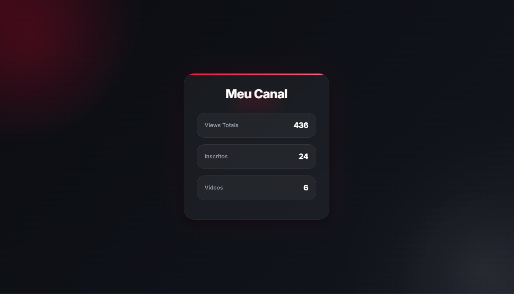

Aqui está um modelo completo e organizado de **README.md** para o seu projeto, já incluindo a imagem com o nome que você especificou (`youtube.png`).

---

```markdown
# 📊 Dashboard de Estatísticas do YouTube

Um projeto web simples e elegante que consome a API do YouTube v3 para exibir as métricas em tempo real de um canal, como visualizações totais, quantidade de inscritos e total de vídeos publicados.

---

## 📸 Demonstração



---

## 🚀 Tecnologias Utilizadas

* **HTML5:** Estruturação semântica da página.
* **CSS3:** Estilização personalizada, utilizando um layout escuro (*dark mode*) moderno e responsivo.
* **JavaScript (ES6):** Consumo assíncrono da API do YouTube através do método `fetch` e manipulação dinâmica do DOM.
* **YouTube Data API v3:** API oficial da Google para obtenção dos dados públicos do canal.

---

## 🛠️ Como Funciona o Código

O projeto faz uma requisição HTTP do tipo `GET` para o endpoint da API do YouTube, utilizando o ID do canal e uma chave de API (*API Key*).

```javascript
let url = `https://www.googleapis.com/youtube/v3/channels?part=statistics&id=${idchannel}&key=${apikey}`

fetch(url)
  .then(res => res.json())
  .then(data => {
    // Extrai e renderiza os dados na tela de forma dinâmica
  })

```

### Funcionalidades:

1. Captura as estatísticas de `viewCount` (Visualizações), `subscriberCount` (Inscritos) e `videoCount` (Vídeos).
2. Injeta os valores diretamente nos elementos HTML correspondentes através do `innerText`.

---

## 📦 Como Executar o Projeto

1. Clone ou baixe os arquivos deste repositório.
2. Certifique-se de manter a seguinte estrutura de pastas:
```text
├── index.html
├── style.css
├── script.js
├── youtube.png
└── icon/
    └── statistics.png

```


3. Abra o arquivo `index.html` diretamente em seu navegador ou utilize a extensão **Live Server** no VS Code para rodar localmente.

---

## 📄 Licença

Este projeto é de uso livre para fins de estudo e aprendizado.

```

```